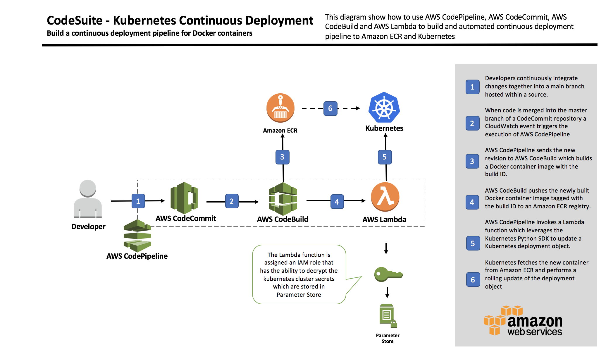
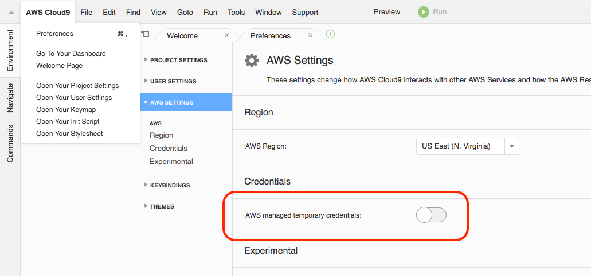

# AWS EKS CICD Workshop using Code* Services

This is a self-paced workshop designed for undesrtanding AWS Code* services like AWS Cloud9, AWS CodeCommit, AWS CodeBuild, AWS Codepipeline and Amazon Lambda can be used for continuous deployment on Amazon EKS.

### Reference-Architecture:

### Deploy the CloudFormation stack:

Click on the "Deploy to AWS" button and follow the CloudFormation prompts to begin.  

CloudFormation creates nested stacks and builds several resources that are required for this workshop. Wait until all the resources are created. Once the status for k8s-workshop changes to CREATE_COMPLETE, you can open Cloud9 IDE. To open the Cloud9 IDE environment, click on the "Outputs" tab in CloudFormation Console and click on the "Cloud9IDE" URL.

### Cloud9 Instance Role

The Cloud9 IDE needs to use the assigned IAM Instance profile. Open the "AWS Cloud9" menu, go to "Preferences", go to "AWS Settings", and disable "AWS managed temporary credentials" as depicted in the diagram here:

### Clean up

### References:

* [AWS Workshop for Kubernetes](https://github.com/aws-samples/aws-workshop-for-kubernetes
)
* [Continuous Deployment Reference Architecture for Kubernetes](https://github.com/aws-samples/aws-kube-codesuite)
* [Continues deployment Kubernetes on AWS with EKS](https://medium.com/@BranLiang/step-by-step-to-setup-continues-deployment-kubernetes-on-aws-with-eks-code-pipeline-and-lambda-61136c84bbcd)

